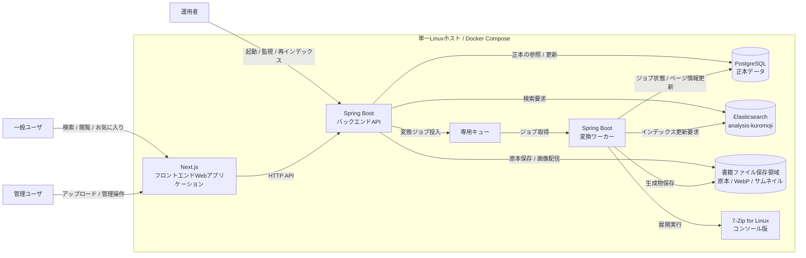
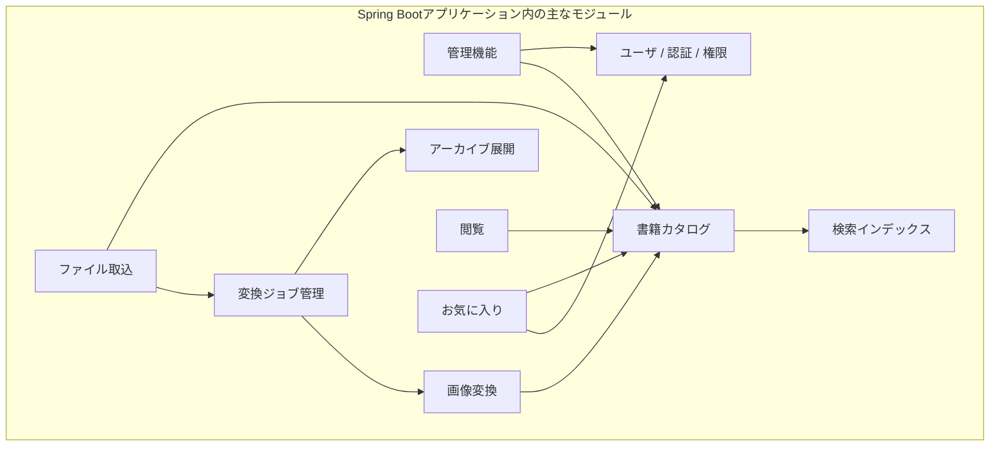
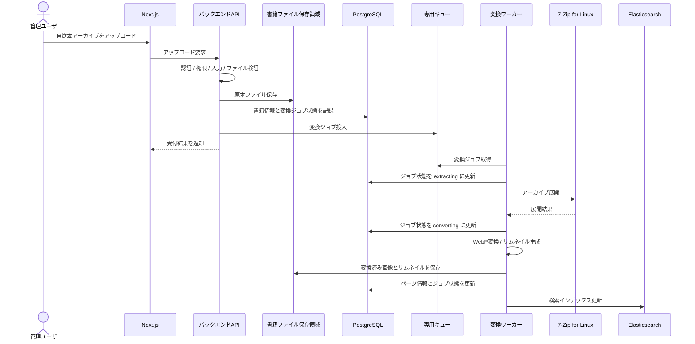
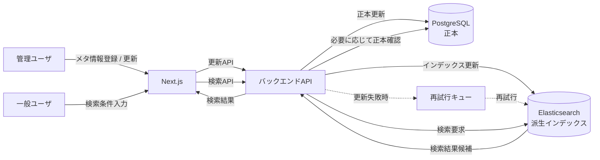
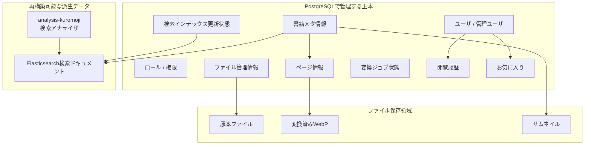

# システム概要

## 目的

このドキュメントは、自炊本閲覧Webアプリケーションのシステム全体像を示す。

詳細な技術選定、データモデル、API契約、ファイル保存、画像変換、検索、権限、運用手順は、それぞれの設計ドキュメントまたはADRで継続的に具体化する。

## システム目的

本システムは、管理ユーザがアップロードした自炊本をWeb閲覧向けに変換し、一般ユーザがブラウザから検索、閲覧、お気に入り管理できる状態にすることを目的とする。

特に、次の課題を解決する。

- zip / rar / 7zip 形式の原本ファイルを、Web閲覧向けのWebP画像へ変換する
- タイトル、著者、タグ、シリーズなどのメタ情報で本を整理、検索できるようにする
- 画像変換などの重い処理を非同期ジョブとして扱い、閲覧や管理操作の応答性を守る
- PostgreSQLを正本、Elasticsearchを再構築可能な検索用派生データとして扱い、データ責務を明確にする
- 初期は単一Linuxホスト上のDocker Composeで運用しつつ、将来的なAPI、Worker、ミドルウェア分離の余地を残す

## 主要機能

### 一般ユーザ向け機能

- 会員登録、メール認証、ログイン、ログアウト
- 本一覧表示
- タイトル、著者、タグ、シリーズによる検索
- ビューアでのページ閲覧
- 閲覧履歴の保存
- お気に入り登録、解除、一覧表示

一般ユーザは書籍を保持せず、書籍アップロードも行わない。

### 管理ユーザ向け機能

- 管理画面へのログイン
- 自炊本アーカイブのアップロード
- タイトル、著者、タグ、シリーズ、種別などのメタ情報管理
- 変換ジョブの状態確認
- 失敗した変換ジョブの確認、再実行
- 管理ユーザ、一般ユーザ、ロール、権限の管理
- Elasticsearch再インデックス操作

書籍アップロードは管理ユーザのみが実行できる。

### 変換処理機能

- アップロードされた原本ファイルの保存
- 専用キューへの変換ジョブ投入
- zip / rar / 7zip アーカイブの展開
- ページ画像のWebP変換
- サムネイル生成
- 変換ジョブ状態の更新
- 失敗時の状態記録と再実行に向けた情報保持

rar / 7zip の展開は、変換ワーカーから7-Zip for Linux コンソール版を外部プロセスとして呼び出して実行する。

## システム構成

本番運用環境は、単一Linuxホスト上のDocker Compose構成とする。

主なコンポーネントは次のとおり。

| コンポーネント | 役割 |
| --- | --- |
| Next.jsフロントエンドWebアプリケーション | 一般ユーザ向け画面、管理ユーザ向け画面を提供する。 |
| Spring BootバックエンドAPI | 認証、書籍管理、検索、閲覧、管理操作のAPIを提供する。 |
| Spring Boot変換ワーカー | 変換ジョブを取得し、アーカイブ展開、WebP変換、サムネイル生成を実行する。 |
| PostgreSQL | メタ情報、ユーザ、権限、ジョブ状態、閲覧履歴などの正本を保持する。 |
| Elasticsearch | タイトル、著者、タグ、シリーズなどの検索用インデックスを保持する。 |
| 専用キュー | APIと変換ワーカーを非同期に接続し、変換ジョブを配送する。 |
| 書籍ファイル保存領域 | 原本ファイル、変換済みWebP画像、サムネイルを保存する。 |
| 7-Zip for Linux コンソール版 | 変換ワーカーから外部プロセスとして呼び出され、rar / 7zip などを展開する。 |

全体構成は次のとおり。

## モジュラーモノリス構成の方針

初期構成では、開発と運用を単純に保つため、Spring Bootプロジェクトは単一アプリ内モジュール構成を基本とする。

ただし、APIと変換ワーカーは責務と実行特性が異なるため、将来的に別アプリケーションまたは別ホストへ分離できる境界を保つ。

想定する主なモジュール境界は次のとおり。

- 書籍カタログ
- ファイル取込
- アーカイブ展開
- 画像変換
- 変換ジョブ管理
- 検索インデックス
- 閲覧
- お気に入り
- ユーザ、認証、権限
- 管理機能

モジュール境界の概念図は次のとおり。

各モジュールでは、コントローラ、アプリケーションサービス、ドメイン、リポジトリ、インフラストラクチャの責務を分離する。ビジネスルールはコントローラやインフラストラクチャに置かず、ユースケース層またはドメイン層で扱う。

## 採用理由

モジュラーモノリス構成を採用する理由は次のとおり。

- 小から中規模のWebアプリケーションとして、初期開発とデプロイを単純にできる
- モジュール境界を明確にすれば、責務の混在を抑えながら開発できる
- API、Worker、PostgreSQL、Elasticsearch、専用キューを将来的に分離する余地を残せる
- 単一Linuxホスト上のDocker Compose運用と相性がよい
- 画像変換や検索など負荷特性の異なる処理を、段階的に分離しやすい

この判断の詳細は、今後作成するADRで記録する。

## パフォーマンス上の基本方針

パフォーマンス上の基本方針は次のとおり。

- アーカイブ展開、画像変換、サムネイル生成は同期HTTPリクエスト内で実行しない
- 変換処理は専用キューと変換ワーカーで非同期実行する
- 変換ワーカーの同時実行数は既定で10とし、application.propertiesで設定可能にする
- 1ジョブのタイムアウトは30分を基本とする
- WebP品質値は既定で80とし、application.propertiesで設定可能にする
- 本一覧、検索結果、ページ一覧など大量データを扱うAPIではページングまたは分割取得を前提とする
- PostgreSQLを正本として一貫性を守り、Elasticsearchは検索性能のための派生データとして扱う
- 画像配信では、原本ファイルではなく変換済みWebP画像とサムネイルを利用する
- メモリ、CPU、一時ディスク使用量の制御は、アプリケーション設定とOSまたはコンテナ側の制御を組み合わせる

## 利用者種別

| 利用者 | 概要 | 主な操作 |
| --- | --- | --- |
| 一般ユーザ | 登録済みの自炊本を読む利用者。書籍は保持しない。 | 登録、ログイン、検索、閲覧、閲覧履歴利用、お気に入り管理 |
| 管理ユーザ | 書籍や利用者を管理する利用者。 | 書籍アップロード、メタ情報管理、変換状態確認、ユーザ管理、ロール管理 |
| 運用者 | システムの起動、停止、監視、障害対応を行う担当者。 | Docker Compose運用、ログ確認、再インデックス、障害対応 |

管理ユーザと運用者は、実装上のアカウント種別やロール設計で重なる可能性がある。詳細は権限設計で定義する。

## 外部依存コンポーネント

本システムが依存する主な外部コンポーネントは次のとおり。

| コンポーネント | 用途 | 方針 |
| --- | --- | --- |
| PostgreSQL | 正本データ保存 | メタ情報、ユーザ、権限、ジョブ状態を保持する。 |
| Elasticsearch + analysis-kuromoji | 日本語検索 | PostgreSQLから再構築可能な派生インデックスとして扱う。 |
| 専用キュー | 非同期ジョブ配送 | DB依存を避け、APIと変換ワーカーを疎結合にする。 |
| 7-Zip for Linux コンソール版 | アーカイブ展開 | 変換ワーカーコンテナ内で外部プロセスとして利用する。 |
| 書籍ファイル保存領域 | ファイル保存 | 原本ファイル、変換済みWebP、サムネイルを保存する。 |
| メール送信基盤 | メール認証、2段階認証、パスワードリセット | 詳細な方式は認証、権限設計で定義する。 |

## ファイル処理の大まかな流れ

ファイル処理の流れは次のとおり。

1. 管理ユーザがNext.jsフロントエンドから自炊本アーカイブをアップロードする。
2. バックエンドAPIが認証、権限、ファイル形式、入力値を検証する。
3. バックエンドAPIが原本ファイルを保存し、PostgreSQLへ書籍情報と変換ジョブ状態を記録する。
4. バックエンドAPIが専用キューへ変換ジョブを投入する。
5. 変換ワーカーが専用キューからジョブを取得する。
6. 変換ワーカーがジョブごとの専用作業ディレクトリでアーカイブを展開する。
7. rar / 7zip の展開が必要な場合、7-Zip for Linux コンソール版を外部プロセスとして呼び出す。
8. 変換ワーカーが画像ファイルをページ順に整理し、WebP画像とサムネイルを生成する。
9. 変換ワーカーが生成結果をファイル保存領域へ保存し、PostgreSQLのジョブ状態とページ情報を更新する。
10. 必要に応じてElasticsearchインデックス更新を実行またはキューへ投入する。

ファイル名、パス、アーカイブ内エントリ、展開先パスは、パストラバーサルや不正なファイル操作を防ぐためにサーバ側で検証する。

## 検索処理の大まかな流れ

検索処理とインデックス更新の流れは次のとおり。

1. 管理ユーザが書籍メタ情報を登録または更新する。
2. バックエンドAPIがPostgreSQLを更新する。
3. 検索対象項目の変更に応じて、Elasticsearchインデックス更新を実行またはキューへ投入する。
4. 一般ユーザがNext.jsフロントエンドから検索条件を入力する。
5. バックエンドAPIが検索条件を検証し、Elasticsearchへ検索要求を送る。
6. Elasticsearchがタイトル、著者、タグ、シリーズなどの検索結果候補を返す。
7. 必要に応じてバックエンドAPIがPostgreSQLの正本データを参照し、権限や表示可能状態を確認する。
8. バックエンドAPIが検索結果をフロントエンドへ返す。

Elasticsearchの更新に失敗した場合は再試行キューに積み、PostgreSQLを正として再インデックスできるようにする。

## データ責務

PostgreSQLは次のデータの正本とする。

- ユーザ
- 管理ユーザ
- ロール、権限
- 書籍メタ情報
- 原本ファイル、変換済み画像、サムネイルの管理情報
- ページ情報
- 変換ジョブ状態
- 閲覧履歴
- お気に入り
- 検索インデックス更新状態

Elasticsearchは、検索性能と日本語検索のための派生データを保持する。Elasticsearchインデックスは破棄しても、PostgreSQLと保存済みメタ情報から再構築できる前提とする。

データ責務の関係は次のとおり。

## セキュリティと入力検証の基本方針

- フロントエンドの検証結果を信頼せず、バックエンドで必ず検証する
- アップロードファイル、アーカイブ内パス、展開先パス、ジョブパラメータを検証する
- 書籍アップロード、削除、変換ジョブ再実行、ユーザ管理などの操作はサーバ側で権限確認する
- パスワード、トークン、シークレット、不要な個人情報をログに出力しない
- 7-Zip外部プロセスにはタイムアウト、作業ディレクトリ分離、エラー処理を設定する
- 生成ファイルや内部ファイルパスを、意図しない形でAPIレスポンスへ露出しない

詳細は `rules/SECURITY.md` および今後作成する権限設計、画像変換設計、ファイル保存設計で扱う。

## 今後詳細化するドキュメント

- `doc/03_architecture/02_technology_stack.md`
- `doc/03_architecture/03_adr/`
- `doc/03_architecture/04_system_context.md`
- `doc/03_architecture/05_container_diagram.md`
- `doc/03_architecture/06_data_flow.md`
- `doc/03_architecture/07_quality_attributes.md`
- `doc/04_design/03_api_contracts/`
- `doc/04_design/04_data_model.md`
- `doc/04_design/05_search_design/01_search_design.md`
- `doc/04_design/06_file_storage_design.md`
- `doc/04_design/07_image_conversion_design.md`
- `doc/04_design/08_authorization_design/01_authorization_design.md`
- `doc/07_operations/01_runbook.md`

## 更新方針

- システム構成、主要な責務分離、データ責務、外部依存が変わった場合は、このドキュメントを更新する。
- 長期的な影響を持つ技術判断は、ADRへ判断理由を記録する。
- 実装や運用手順の詳細は、概要に書きすぎず、関連する設計ドキュメントまたはRunbookへ分離する。
