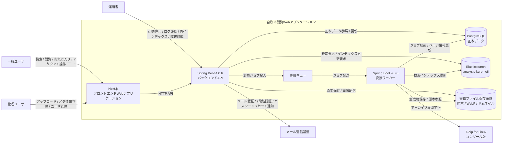

# システムコンテキスト

## 目的

このドキュメントは、自炊本閲覧Webアプリケーションと、利用者および周辺システムとの関係を整理する。

コンテナ単位の詳細な配置、プロセス分割、通信方式、永続化方式は `doc/03_architecture/05_container_diagram/01_container_diagram.md` で詳細化する。

## 対象システム

対象システムは、管理ユーザがアップロードした自炊本をWeb閲覧向けに変換し、一般ユーザがブラウザから検索、閲覧、お気に入り管理できるようにするWebアプリケーションである。

システムは単一Linuxホスト上のDocker Compose構成から開始する。初期構成ではNext.jsフロントエンド、Spring BootバックエンドAPI、Spring Boot変換ワーカー、PostgreSQL、Elasticsearch、専用キュー、書籍ファイル保存領域を同一ホスト上に配置する。ただし、API、Worker、ミドルウェアを将来的に別アプリケーションまたは別ホストへ分離できるように責務境界を保つ。

## 利用者と外部アクター

| アクター | 種別 | システムとの関係 |
| --- | --- | --- |
| 一般ユーザ | 人 | ブラウザから本を検索、閲覧し、お気に入りと閲覧履歴を利用する。書籍アップロードは行わない。 |
| 管理ユーザ | 人 | ブラウザから書籍アップロード、メタ情報管理、変換ジョブ確認、ユーザ管理、ロール管理を行う。 |
| 運用者 | 人 | Docker Compose環境、ログ、ジョブ滞留、再インデックス、障害対応を管理する。管理ユーザと同一人物になる可能性がある。 |
| メール送信基盤 | 外部システム | 会員登録時のメール認証、ログイン時の2段階認証、パスワードリセット通知に利用する。具体的なサービスは権限設計で決定する。 |
| 7-Zip for Linux コンソール版 | 外部ツール | 変換ワーカーから外部プロセスとして呼び出し、zip / rar / 7zip アーカイブを展開する。 |

## システム境界

本システムの境界内に含めるものは次のとおり。

- Next.jsフロントエンドWebアプリケーション
- Spring Boot 4.0.6バックエンドAPI
- Spring Boot 4.0.6変換ワーカー
- PostgreSQL
- Elasticsearch + analysis-kuromoji
- 専用キュー
- 書籍ファイル保存領域

本システムの境界外として扱うものは次のとおり。

- 一般ユーザ、管理ユーザ、運用者が利用するブラウザ
- メール送信基盤
- 7-Zip for Linux コンソール版の配布元、更新元
- OS、Docker、Docker Composeそのものの運用基盤

7-Zip for Linux コンソール版は変換ワーカーコンテナ内で利用するが、アプリケーションコードではなく外部実行ファイルとして扱う。そのため、入力パス、展開先、実行タイムアウト、終了コード、標準出力、標準エラーを変換ワーカー側で明示的に制御する。

## コンテキスト図

## 主要な関係

### 一般ユーザとシステム

一般ユーザはNext.jsフロントエンドを通じて本を探し、閲覧する。主な操作は会員登録、ログイン、検索、本一覧表示、ビューア表示、お気に入り管理、閲覧履歴利用である。

一般ユーザは書籍を保持せず、書籍アップロードも行わない。表示可能な書籍や操作可能な機能は、バックエンドAPIで認証、認可、公開状態を確認して制御する。

### 管理ユーザとシステム

管理ユーザはNext.jsフロントエンドを通じて、書籍アーカイブのアップロード、メタ情報管理、変換ジョブ確認、ユーザ管理、ロール管理を行う。

書籍アップロードは管理ユーザのみが実行できる。アップロードファイル、メタ情報、ジョブ再実行などの入力はバックエンドAPIで検証し、権限確認を行う。

### フロントエンドとバックエンドAPI

Next.jsフロントエンドは、画面表示、入力補助、API呼び出し、ユーザ体験上の状態管理を担当する。

Spring BootバックエンドAPIは、HTTP API、認証、認可、入力検証、ユースケース実行、PostgreSQL更新、Elasticsearch検索、ファイル保存領域の参照、専用キューへのジョブ投入を担当する。

フロントエンドの検証結果は信頼せず、サーバ側で外部入力を検証する。

### バックエンドAPIとPostgreSQL

PostgreSQLは正本データの保存先である。ユーザ、管理ユーザ、ロール、権限、書籍メタ情報、ファイル管理情報、ページ情報、変換ジョブ状態、閲覧履歴、お気に入り、検索インデックス更新状態を保持する。

Elasticsearch、変換済みWebP、サムネイル、ジョブ配送状態に不整合が起きた場合も、PostgreSQLを基準に確認、再実行、再インデックスを行う。

### バックエンドAPIとElasticsearch

Elasticsearchは検索用の派生データを保持する。タイトル、著者、タグ、シリーズなどの日本語検索にはanalysis-kuromojiを使用する。

検索結果の権限や表示可否が重要な場合は、必要に応じてPostgreSQLの正本データで確認する。ElasticsearchインデックスはPostgreSQLから再構築可能なものとして扱う。

### バックエンドAPIと専用キュー

バックエンドAPIは、アップロード受付後に変換ジョブを専用キューへ投入する。

アーカイブ展開、WebP変換、サムネイル生成のような重い処理はHTTPリクエスト内で実行しない。専用キューにより、APIと変換ワーカーの責務、リソース制御、障害影響を分離する。

### 変換ワーカーと周辺コンポーネント

変換ワーカーは専用キューからジョブを取得し、ジョブ状態をPostgreSQLへ記録しながら、書籍ファイル保存領域の原本ファイルを処理する。

zip / rar / 7zip の展開には7-Zip for Linux コンソール版を外部プロセスとして呼び出す。展開後、ページ画像をWebPへ変換し、サムネイルを生成して書籍ファイル保存領域へ保存する。

変換結果はPostgreSQLへ記録し、必要に応じてElasticsearchの検索インデックスを更新する。

### 書籍ファイル保存領域

書籍ファイル保存領域には、原本ファイル、変換済みWebP画像、サムネイルを保存する。

ファイルパスは内部実装の詳細として扱い、APIレスポンスへ不用意に露出しない。アップロードファイル、アーカイブ内エントリ、展開先パス、生成ファイル名はサーバ側で検証し、パストラバーサルや不正なファイル操作を防ぐ。

### メール送信基盤

メール送信基盤は、会員登録時のメール認証、ログイン時の2段階認証、パスワードリセット通知に利用する。

メール本文、トークン、有効期限、送信失敗時の扱い、具体的なサービス選定は、認証仕様または権限設計で詳細化する。シークレットや認証情報は環境変数または外部設定で渡し、Gitにコミットしない。

## 信頼境界と検証責務

| 境界 | 主なリスク | 検証、制御方針 |
| --- | --- | --- |
| ブラウザからバックエンドAPI | 不正入力、権限外操作、CSRF / セッション悪用 | 認証、認可、入力検証、操作対象の権限確認をサーバ側で行う。 |
| アップロードファイルからシステム内部 | 非対応形式、破損ファイル、巨大ファイル、パストラバーサル | ファイル形式、アーカイブ内容、展開先、ジョブパラメータを検証する。 |
| 変換ワーカーから7-Zip外部プロセス | 外部プロセス失敗、タイムアウト、想定外出力 | ジョブごとの作業ディレクトリ、タイムアウト、終了コード確認、エラー記録を行う。 |
| API / Workerからファイル保存領域 | 内部パス露出、不正な読み書き、生成物の混在 | 保存先とファイル名をサーバ側で制御し、内部パスをAPI契約に露出しない。 |
| PostgreSQLからElasticsearch | インデックス更新失敗、検索結果の不整合 | PostgreSQLを正本とし、再試行と再インデックスで回復可能にする。 |
| システムからメール送信基盤 | 認証情報漏えい、送信失敗、トークン漏えい | シークレットを外部設定で管理し、トークンをログに出力しない。 |

## このドキュメントで扱わない詳細

次の詳細は、別ドキュメントで扱う。

| 詳細 | 反映先 |
| --- | --- |
| コンテナ単位の構成、通信、配置 | `doc/03_architecture/05_container_diagram/01_container_diagram.md` |
| アップロード、変換、検索、閲覧の詳細なデータフロー | `doc/03_architecture/06_data_flow/01_data_flow.md` |
| レスポンス時間、スループット、容量、同時実行数などの品質特性 | `doc/03_architecture/07_quality_attributes/01_quality_attributes.md` |
| API URL、リクエスト、レスポンス、エラー形式 | `doc/04_design/03_api_contracts/` |
| 書籍、ページ、ジョブ、ユーザ、権限のデータモデル | `doc/04_design/04_data_model/01_data_model.md` |
| ファイル保存先、命名規則、削除タイミング | `doc/04_design/06_file_storage_design/01_file_storage_design.md` |
| アーカイブ展開、画像判定、WebP変換、再変換 | `doc/04_design/07_image_conversion_design/01_image_conversion_design.md` |
| 認証、メール認証、2段階認証、ロール、権限 | `doc/04_design/08_authorization_design/01_authorization_design.md` |

## 更新方針

利用者種別、外部システム、主要コンポーネント、信頼境界、データ責務が変わった場合は、このドキュメントを更新する。

コンテキスト上の関係が変わる技術判断は、必要に応じてADRにも判断理由を記録する。
