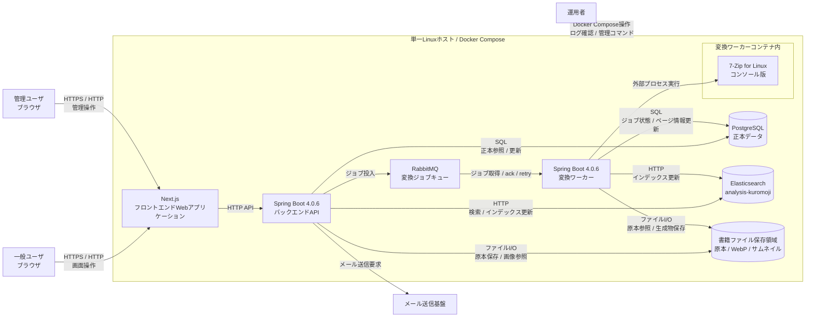

# コンテナ図

## 目的

このドキュメントは、自炊本閲覧Webアプリケーションを構成する主要コンテナ、責務、通信関係、配置方針を整理する。

システム外部の利用者や外部システムとの関係は [doc/03_architecture/04_system_context.md](04_system_context.md) で扱う。各ユースケースの詳細な処理順序は [doc/03_architecture/06_data_flow.md](06_data_flow.md) で扱う。

## 前提

本システムは、初期構成では単一Linuxホスト上のDocker Composeで運用する。

主な構成要素は次のとおり。

- Next.jsフロントエンドWebアプリケーション
- Spring Boot 4.0.6バックエンドAPI
- Spring Boot 4.0.6変換ワーカー
- PostgreSQL
- Elasticsearch + analysis-kuromoji
- RabbitMQ
- 書籍ファイル保存領域
- 7-Zip for Linux コンソール版

バックエンドAPIと変換ワーカーはどちらもSpring Boot 4.0.6で構築するが、責務と実行特性が異なるため、別プロセス、別コンテナとして扱う。将来的に別アプリケーションまたは別ホストへ分離できるように、APIとWorkerの境界を保つ。

## コンテナ一覧

| コンテナ / 領域 | 技術 | 主な責務 |
| --- | --- | --- |
| Next.jsフロントエンドWebアプリケーション | Next.js | 一般ユーザ向け画面、管理ユーザ向け画面、API呼び出し、画面状態管理を担当する。 |
| Spring BootバックエンドAPI | Spring Boot 4.0.6 / Java 25 | HTTP API、認証、認可、入力検証、書籍管理、検索、閲覧、管理操作、ジョブ投入を担当する。 |
| Spring Boot変換ワーカー | Spring Boot 4.0.6 / Java 25 | RabbitMQからジョブを取得し、アーカイブ展開、WebP変換、サムネイル生成、ジョブ状態更新を担当する。 |
| PostgreSQL | PostgreSQL | メタ情報、ユーザ、権限、ジョブ状態、閲覧履歴、お気に入りなどの正本を保持する。 |
| Elasticsearch | Elasticsearch + analysis-kuromoji | タイトル、著者、タグ、シリーズなどの日本語検索用インデックスを保持する。 |
| RabbitMQ | RabbitMQ | バックエンドAPIと変換ワーカーを非同期に接続し、変換ジョブを配送する。 |
| 書籍ファイル保存領域 | ホストボリュームまたはコンテナから参照可能な永続領域 | 原本ファイル、変換済みWebP画像、サムネイルを保存する。 |
| 7-Zip for Linux コンソール版 | 外部実行ファイル | 変換ワーカーコンテナ内で外部プロセスとして呼び出され、zip / rar / 7zip アーカイブを展開する。 |

## コンテナ図

## 通信関係

| 呼び出し元 | 呼び出し先 | 方式 | 用途 |
| --- | --- | --- | --- |
| ブラウザ | Next.jsフロントエンド | HTTPS / HTTP | 画面表示、ユーザ操作、管理操作を行う。 |
| Next.jsフロントエンド | Spring BootバックエンドAPI | HTTP API | 認証、書籍管理、検索、閲覧、管理操作を実行する。 |
| Spring BootバックエンドAPI | PostgreSQL | SQL | 正本データを参照、更新する。 |
| Spring BootバックエンドAPI | Elasticsearch | HTTP | 検索要求、検索インデックス更新要求を行う。 |
| Spring BootバックエンドAPI | 書籍ファイル保存領域 | ファイルI/O | 原本ファイル保存、変換済み画像やサムネイルの参照を行う。 |
| Spring BootバックエンドAPI | RabbitMQ | AMQP | 変換ジョブを投入する。 |
| Spring BootバックエンドAPI | メール送信基盤 | HTTP / SMTPなど | メール認証、2段階認証、パスワードリセット通知を送信する。 |
| 変換ワーカー | RabbitMQ | AMQP | 変換ジョブを取得し、ack、再配送、dead letterを扱う。 |
| 変換ワーカー | PostgreSQL | SQL | ジョブ状態、ページ情報、変換結果を更新する。 |
| 変換ワーカー | 書籍ファイル保存領域 | ファイルI/O | 原本ファイルを読み取り、WebP画像とサムネイルを保存する。 |
| 変換ワーカー | Elasticsearch | HTTP | 変換完了後またはメタ情報更新後のインデックス更新を行う。 |
| 変換ワーカー | 7-Zip for Linux コンソール版 | 外部プロセス実行 | zip / rar / 7zip アーカイブを展開する。 |

## 各コンテナの責務

### Next.jsフロントエンドWebアプリケーション

Next.jsフロントエンドは、一般ユーザ向け画面と管理ユーザ向け画面を提供する。

主な責務は次のとおり。

- 会員登録、ログイン、ログアウト画面を提供する
- 本一覧、検索結果、ビューア、お気に入り画面を提供する
- 管理ユーザ向けにアップロード、メタ情報編集、ジョブ状態確認、ユーザ管理画面を提供する
- バックエンドAPIを呼び出し、成功、失敗、変換待ち、変換失敗などの状態を画面へ反映する

認証、認可、入力値、ファイル、アーカイブ内容の最終検証はバックエンドAPIで行う。フロントエンドのチェックはユーザ体験上の補助として扱う。

### Spring BootバックエンドAPI

Spring BootバックエンドAPIは、HTTP APIとユースケース実行を担当する。

主な責務は次のとおり。

- 認証、認可、入力検証を行う
- 書籍メタ情報、ユーザ、権限、閲覧履歴、お気に入りを管理する
- 書籍アップロード要求を受け付け、原本ファイルを保存する
- PostgreSQLへ正本データを記録する
- Elasticsearchへ検索要求を送る
- 変換ジョブをRabbitMQへ投入する
- 変換済み画像やサムネイルの参照に必要なAPIを提供する
- 管理操作と再インデックス操作を提供する

アーカイブ展開、WebP変換、サムネイル生成のような長時間処理は、バックエンドAPIのHTTPリクエスト内では実行しない。

### Spring Boot変換ワーカー

Spring Boot変換ワーカーは、変換ジョブを非同期に処理する。

主な責務は次のとおり。

- RabbitMQから変換ジョブを取得する
- ジョブ状態をPostgreSQLへ記録する
- 書籍ファイル保存領域から原本ファイルを参照する
- ジョブごとの専用作業ディレクトリでアーカイブを展開する
- 7-Zip for Linux コンソール版を外部プロセスとして呼び出す
- ページ画像をWebPへ変換し、サムネイルを生成する
- 生成物を書籍ファイル保存領域へ保存する
- ページ情報、変換結果、失敗理由をPostgreSQLへ記録する
- 必要に応じてElasticsearchインデックスを更新する

変換ワーカーの同時実行数は既定で10、1ジョブのタイムアウトは30分とし、application.propertiesで変更可能にする。

### PostgreSQL

PostgreSQLは本システムの正本データを保持する。

主なデータは次のとおり。

- ユーザ、管理ユーザ
- ロール、権限
- 書籍メタ情報
- ファイル管理情報
- ページ情報
- 変換ジョブ状態
- 閲覧履歴
- お気に入り
- 検索インデックス更新状態

Elasticsearchやファイル保存領域との不整合が発生した場合は、PostgreSQLを基準に確認、再実行、再インデックスを行う。

### Elasticsearch + analysis-kuromoji

Elasticsearchは、検索性能と日本語検索のための派生インデックスを保持する。

主な責務は次のとおり。

- タイトル、著者、タグ、シリーズを検索可能にする
- analysis-kuromojiによる日本語検索を提供する
- 必要に応じて補完、部分一致、表記揺れ対策用フィールドを持つ

Elasticsearchだけに業務上の正本データを持たせない。インデックスはPostgreSQLから再構築可能なものとして扱う。

### RabbitMQ

RabbitMQは、バックエンドAPIと変換ワーカーを非同期に接続する専用キューとして利用する。

主な責務は次のとおり。

- 変換ジョブを受け付ける
- 変換ワーカーへジョブを配送する
- 変換ワーカーのack、再配送、dead letterを扱う
- ジョブ滞留や失敗を運用上観測できるようにする

業務上のジョブ状態はPostgreSQLの`conversion_job`を正本とし、RabbitMQにはジョブ配送に必要な最小限のメッセージを置く。配送保証はat-least-onceとし、重複配送はPostgreSQLの状態確認により冪等に扱う。

### 書籍ファイル保存領域

書籍ファイル保存領域は、原本ファイル、変換済みWebP画像、サムネイルを保存する。

ファイルパスは内部実装の詳細として扱う。APIレスポンスへ物理パスを不用意に露出しない。

保存先、命名規則、削除タイミング、バックアップなし運用との関係は、ファイル保存設計で詳細化する。

### 7-Zip for Linux コンソール版

7-Zip for Linux コンソール版は、変換ワーカーコンテナ内で外部プロセスとして利用する。

主な用途は次のとおり。

- zip アーカイブの展開
- rar アーカイブの展開
- 7zip アーカイブの展開

変換ワーカーは、実行ファイルパス、引数、作業ディレクトリ、タイムアウト、終了コード、標準出力、標準エラーを制御する。アーカイブ内パスと展開先パスは検証し、パストラバーサルを防ぐ。

## APIと変換ワーカーの責務分離

APIと変換ワーカーは、同じSpring BootとJava 25を使うが、次のように責務を分離する。

| 領域 | バックエンドAPI | 変換ワーカー |
| --- | --- | --- |
| HTTPリクエスト処理 | 担当する | 担当しない |
| 認証、認可 | 担当する | 原則としてAPIで検証済みのジョブを処理する |
| アップロード受付 | 担当する | 担当しない |
| 原本ファイル保存 | 担当する | 参照する |
| 変換ジョブ投入 | 担当する | 担当しない |
| 変換ジョブ取得 | 担当しない | 担当する |
| アーカイブ展開 | 担当しない | 担当する |
| WebP変換 / サムネイル生成 | 担当しない | 担当する |
| ジョブ状態更新 | 受付時に記録する | 処理中、完了、失敗を記録する |
| 検索要求 | 担当する | 担当しない |
| インデックス更新 | メタ情報更新時に担当する | 変換完了時に必要なら担当する |

この分離により、画像変換のCPU、メモリ、ディスクI/O、外部プロセス実行の負荷が、閲覧や管理操作のHTTP応答へ直接影響しにくい構成にする。

## 永続化とボリューム

Docker Composeでは、次のデータを永続化対象として扱う。

| 対象 | 永続化理由 |
| --- | --- |
| PostgreSQLデータ | 正本データを保持するため。 |
| Elasticsearchデータ | 検索インデックスを保持するため。ただし再構築可能な派生データとして扱う。 |
| 書籍ファイル保存領域 | 原本ファイル、変換済みWebP、サムネイルを保持するため。 |
| RabbitMQの永続データ | 変換ジョブメッセージの消失を避けるために保持する。 |

バックアップは行わない方針である。ただし、PostgreSQL、Elasticsearch、書籍ファイル保存領域の責務とリスクは、バックアップなし方針とRunbookで明記する。

## 設定とシークレット

次の値は、application.propertiesまたは環境変数で設定可能にする。

- PostgreSQL接続情報
- Elasticsearch接続情報
- RabbitMQ接続情報
- 書籍ファイル保存領域のパス
- 7-Zip実行ファイルパス
- WebP品質値
- 変換ワーカー同時実行数
- 1ジョブのタイムアウト
- メール送信基盤の接続情報

シークレット、パスワード、トークン、接続文字列はGitにコミットしない。

## 今後詳細化する事項

次の事項は、後続の設計ドキュメントまたはADRで詳細化する。

- API、Worker、RabbitMQ、ミドルウェアのDocker Composeサービス名とネットワーク設定
- 書籍ファイル保存領域の物理パス、命名規則、削除タイミング
- 変換ワーカーの作業ディレクトリ、クリーンアップ、再試行、デッドレター
- Elasticsearchインデックス名、mapping、analyzer、再インデックス手順
- メール送信基盤の具体的な方式
- 本番運用時の監視、ログ、リソース制限

## 更新方針

コンテナ、プロセス境界、通信方式、永続化対象、APIとWorkerの責務分離が変わった場合は、このドキュメントを更新する。

長期的な影響を持つ技術判断は、必要に応じてADRへ判断理由を記録する。
