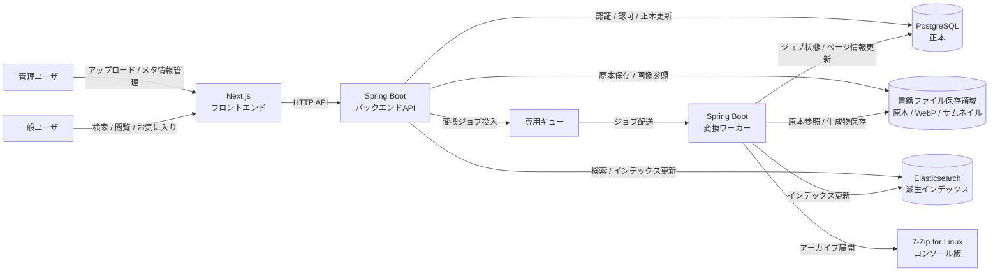
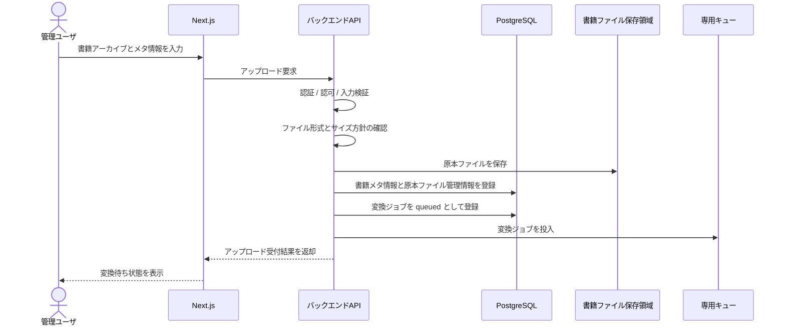
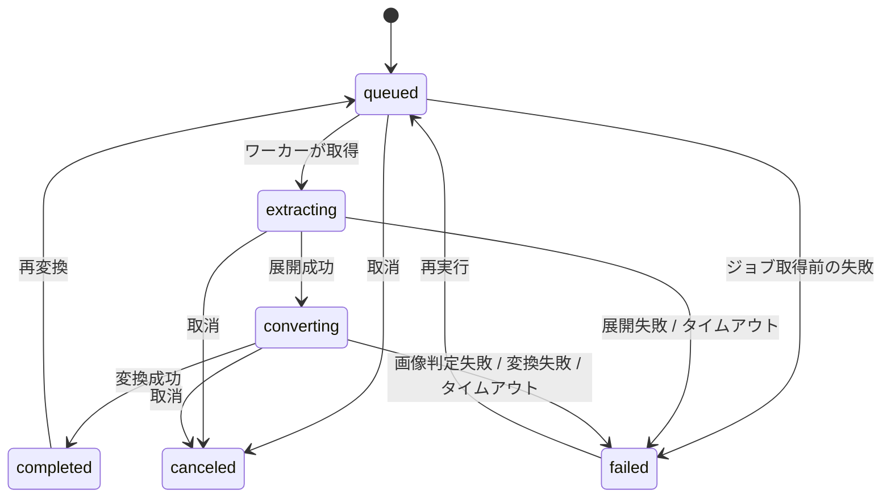
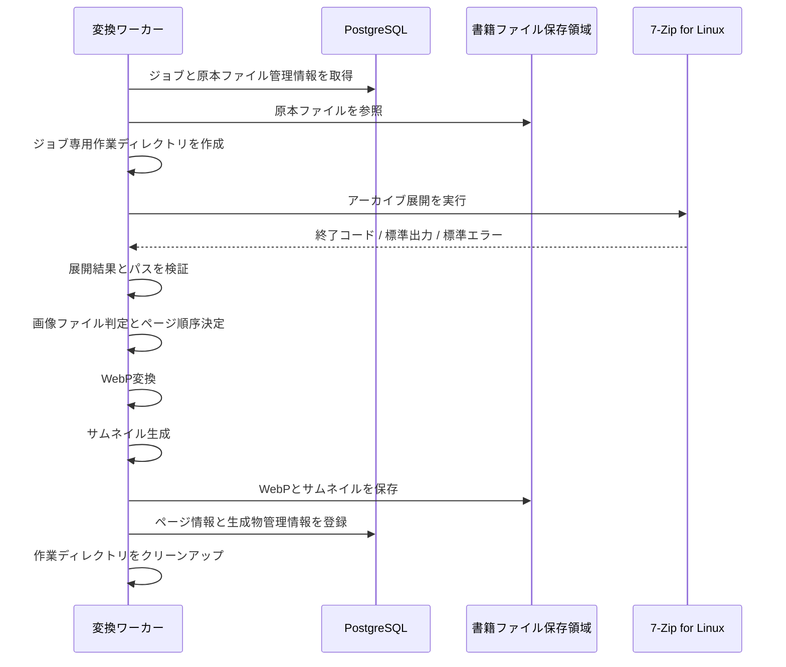
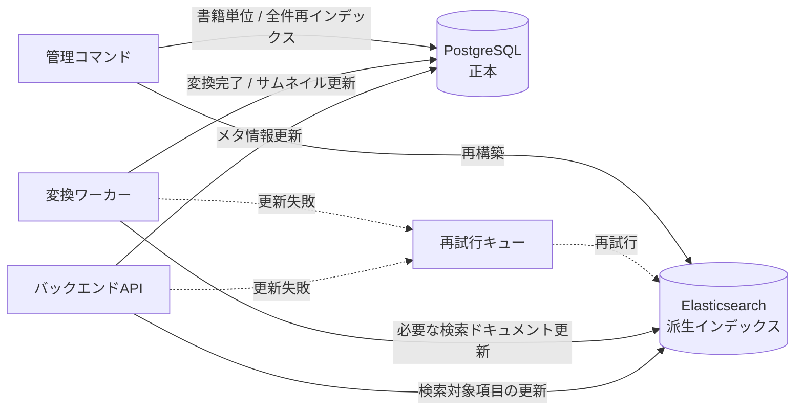
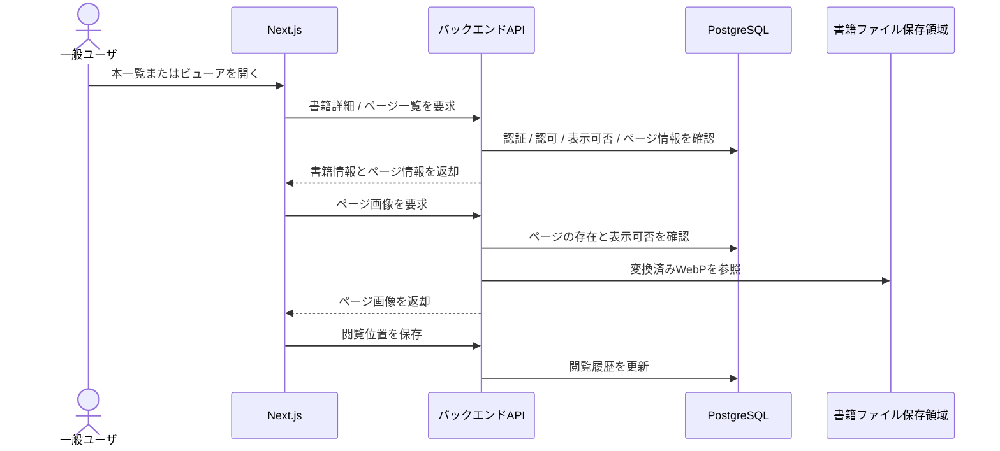
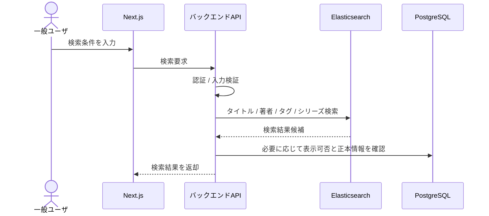

# データフロー

## 目的

このドキュメントは、自炊本閲覧Webアプリケーションにおける主要なデータの流れを整理する。

対象は、書籍アップロード、変換ジョブ、アーカイブ展開、WebP変換、サムネイル生成、検索インデックス更新、閲覧、検索、失敗時の回復である。

コンテナ単位の責務と通信関係は `doc/03_architecture/05_container_diagram.md` で扱う。データモデル、API契約、ファイル保存、画像変換、検索、権限の詳細は、後続の設計ドキュメントで具体化する。

## 前提

- PostgreSQLを正本データの保存先とする。
- ElasticsearchはPostgreSQLから再構築可能な検索用派生データとする。
- 原本ファイル、変換済みWebP、サムネイルは書籍ファイル保存領域に保存する。
- 書籍アップロードは管理ユーザのみが実行できる。
- アーカイブ展開、WebP変換、サムネイル生成はHTTPリクエスト内では実行せず、専用キューと変換ワーカーで非同期に処理する。
- zip / rar / 7zip の展開には、変換ワーカーコンテナ内の7-Zip for Linux コンソール版を外部プロセスとして使用する。
- WebP品質値の既定値は80とし、application.propertiesで変更可能にする。
- 変換ワーカーの同時実行数の既定値は10、1ジョブのタイムアウトは30分とし、application.propertiesで変更可能にする。

## データ種別と責務

| データ | 正本 / 派生 | 主な保存先 | 更新主体 | 備考 |
| --- | --- | --- | --- | --- |
| ユーザ、管理ユーザ、ロール、権限 | 正本 | PostgreSQL | バックエンドAPI | 認証、認可、管理操作で参照する。 |
| 書籍メタ情報 | 正本 | PostgreSQL | バックエンドAPI | タイトル、著者、タグ、シリーズ、種別などを保持する。 |
| 原本ファイル管理情報 | 正本 | PostgreSQL | バックエンドAPI | 物理パスはAPIレスポンスへ不用意に露出しない。 |
| 原本ファイル | 永続ファイル | 書籍ファイル保存領域 | バックエンドAPI | アップロード後も保存し続ける。 |
| 変換ジョブ状態 | 正本 | PostgreSQL | バックエンドAPI / 変換ワーカー | キュー配送状態だけに依存せず、業務上の状態をPostgreSQLへ記録する。 |
| ページ情報 | 正本 | PostgreSQL | 変換ワーカー | ページ順、画像管理情報、変換状態を保持する。 |
| 変換済みWebP | 派生ファイル | 書籍ファイル保存領域 | 変換ワーカー | 原本ファイルと変換条件から再生成できる。 |
| サムネイル | 派生ファイル | 書籍ファイル保存領域 | 変換ワーカー | 一覧、検索結果、詳細画面で利用する。 |
| 検索ドキュメント | 派生データ | Elasticsearch | バックエンドAPI / 変換ワーカー / 管理コマンド | PostgreSQLから再構築できる。 |
| 検索インデックス更新状態 | 正本 | PostgreSQL | バックエンドAPI / 変換ワーカー / 管理コマンド | 更新失敗、再試行、再インデックスの判断に利用する。 |
| 閲覧履歴 | 正本 | PostgreSQL | バックエンドAPI | ユーザの最後に読んだページや最終閲覧日時を保持する。 |
| お気に入り | 正本 | PostgreSQL | バックエンドAPI | ユーザと書籍の関連として保持する。 |

## 全体データフロー

## 書籍アップロードから原本保存まで

処理方針は次のとおり。

1. バックエンドAPIは、管理ユーザの認証、書籍アップロード権限、入力値、アップロードファイルを検証する。
2. フロントエンドの検証結果は信頼せず、サーバ側で必ず検証する。
3. 原本ファイルは書籍ファイル保存領域へ保存し、保存先の管理情報をPostgreSQLへ記録する。
4. PostgreSQLには書籍メタ情報、原本ファイル管理情報、変換ジョブ状態を同じユースケース内で記録する。
5. アップロード受付後、バックエンドAPIは専用キューへ変換ジョブを投入し、HTTPレスポンスでは変換完了を待たない。
6. キュー投入に失敗した場合でも、PostgreSQL上のジョブ状態を基準に、再投入または失敗状態への遷移を判断できるようにする。

## 変換ジョブ投入、取得、実行、状態更新

変換ジョブの状態は、後続のデータモデルと画像変換設計で詳細化する。初期候補は次のとおり。

| 状態 | 意味 | 主な更新主体 |
| --- | --- | --- |
| `queued` | 変換待ち。キュー投入済み、または再投入待ち。 | バックエンドAPI |
| `extracting` | 原本アーカイブを展開中。 | 変換ワーカー |
| `converting` | ページ画像をWebPへ変換中、またはサムネイル生成中。 | 変換ワーカー |
| `completed` | 変換が完了し、閲覧に必要な生成物とページ情報が揃っている。 | 変換ワーカー |
| `failed` | 変換に失敗し、失敗理由を確認できる。 | 変換ワーカー |
| `canceled` | 管理操作またはシステム判断で取り消された。 | バックエンドAPI / 変換ワーカー |

処理方針は次のとおり。

1. 変換ワーカーは専用キューからジョブを取得する。
2. 取得したジョブについて、PostgreSQLの変換ジョブ状態と対象書籍の存在を確認する。
3. 処理開始時に状態を`extracting`へ更新し、ジョブ開始日時を記録する。
4. 展開が成功したら状態を`converting`へ更新する。
5. 変換済みWebP、サムネイル、ページ情報の保存が完了したら状態を`completed`へ更新する。
6. 失敗時は状態を`failed`へ更新し、失敗工程、失敗理由、外部プロセス終了コード、タイムアウト有無など、運用者が原因を追える情報を記録する。
7. キューのack、retry、dead letterの具体方式は、非同期変換ジョブ方式ADRと画像変換設計で決定する。

## アーカイブ展開からWebP変換、サムネイル生成まで

処理方針は次のとおり。

1. 変換ワーカーはジョブごとの専用作業ディレクトリを作成し、他ジョブの一時ファイルと混在させない。
2. 7-Zip for Linux コンソール版は外部プロセスとして呼び出し、実行ファイルパス、引数、作業ディレクトリ、タイムアウト、終了コード、標準出力、標準エラーを制御する。
3. 展開先パスとアーカイブ内エントリを検証し、パストラバーサルを防ぐ。
4. 展開後のファイルから画像ファイルを判定し、ページ順序を決定する。判定方法と順序仕様は画像変換設計で詳細化する。
5. WebP変換では、既定品質値80を使用し、application.propertiesの設定値で上書き可能にする。
6. サムネイルは一覧、検索結果、詳細画面で利用できるように生成する。
7. 生成物は書籍ファイル保存領域へ保存し、PostgreSQLへページ情報と生成物管理情報を記録する。
8. 処理完了または失敗後、作業ディレクトリをクリーンアップする。クリーンアップ失敗時は、変換結果とは別に運用確認できる情報をログまたはジョブ診断情報へ残す。

## PostgreSQL更新とElasticsearchインデックス更新

PostgreSQLとElasticsearchの責務は明確に分ける。

- PostgreSQLは書籍メタ情報、ページ情報、変換状態、検索インデックス更新状態の正本である。
- Elasticsearchは検索のための派生インデックスであり、破棄してもPostgreSQLから再構築できる。

処理方針は次のとおり。

1. 書籍メタ情報を登録または更新する場合、バックエンドAPIはまずPostgreSQLを更新する。
2. 検索対象項目が変わった場合、Elasticsearchの該当ドキュメントを更新する。
3. 変換完了によりサムネイルや閲覧可能状態が変わる場合、必要に応じてElasticsearchの該当ドキュメントを更新する。
4. Elasticsearch更新に失敗した場合、PostgreSQL上の検索インデックス更新状態を失敗または再試行待ちとして記録し、再試行キューへ積む。
5. 書籍単位の再インデックスと全件再インデックスを管理コマンドとして用意する。
6. Elasticsearchの内容が疑わしい場合は、PostgreSQLを基準にインデックスを破棄、再構築できるようにする。

## 閲覧時の画像配信

処理方針は次のとおり。

1. 閲覧APIは、認証、認可、書籍の表示可否、ページの存在をPostgreSQLで確認する。
2. ビューアでは原本ファイルではなく変換済みWebPを配信する。
3. 一覧、検索結果、詳細画面ではサムネイルを利用し、大きなページ画像を不要に読み込まない。
4. 変換が未完了または失敗している場合、APIは状態を明示し、フロントエンドは変換待ちまたは失敗として表示する。
5. ページ画像の物理パスはAPIレスポンスへ直接露出せず、API経由で参照する。
6. 閲覧履歴はPostgreSQLへ保存する。

## 検索時のデータ参照

処理方針は次のとおり。

1. バックエンドAPIは検索条件を検証し、Elasticsearchへ検索要求を送る。
2. Elasticsearchではanalysis-kuromojiを利用した日本語検索を行う。
3. 検索結果の権限や表示可否が重要な場合、APIはPostgreSQLで正本情報を確認する。
4. Elasticsearchに存在しない重要な業務データを検索結果の唯一の根拠にしない。
5. インデックス遅延がある場合でも、PostgreSQLを正として再インデックスや書籍単位の更新で回復できるようにする。

## 失敗時の再試行、再構築、整合性回復

### アップロード受付時の失敗

| 失敗箇所 | 主な対応 |
| --- | --- |
| 認証、認可、入力検証 | 原本保存やDB更新を行わず、エラーを返却する。 |
| 原本ファイル保存 | 書籍メタ情報やジョブを確定させず、必要に応じて一時ファイルを削除する。 |
| PostgreSQL更新 | 原本ファイルが残った場合は、未参照ファイルとして検出、削除できるようにする。 |
| キュー投入 | PostgreSQL上のジョブ状態を基準に、再投入または失敗状態への遷移を行う。 |

### 変換時の失敗

| 失敗箇所 | 主な対応 |
| --- | --- |
| ジョブ取得 | キューの再配送または再試行を利用する。業務上の状態はPostgreSQLで確認する。 |
| 原本ファイル参照 | `failed`へ更新し、原本ファイル管理情報と物理ファイルの不整合を調査対象にする。 |
| アーカイブ展開 | `failed`へ更新し、終了コード、標準エラー、タイムアウト有無を記録する。 |
| 画像ファイル判定 | `failed`へ更新し、非対応形式、画像なし、破損ファイルなどを区別できるようにする。 |
| WebP変換 | `failed`へ更新し、対象ページ、変換条件、例外情報を記録する。 |
| 生成物保存 | `failed`へ更新し、途中生成物の扱いを画像変換設計またはファイル保存設計で定義する。 |
| PostgreSQL更新 | 生成物が残った場合は、PostgreSQLを正として再実行または生成物クリーンアップを行う。 |
| Elasticsearch更新 | 検索インデックス更新状態を再試行待ちにし、再試行または再インデックスで回復する。 |

### Elasticsearch整合性回復

Elasticsearchは派生データとして扱うため、次の回復手段を用意する。

1. 書籍単位の再インデックスを実行する。
2. 全件再インデックスを実行する。
3. 必要に応じてElasticsearchインデックスを破棄し、PostgreSQLから再構築する。
4. 更新失敗時は再試行キューに積み、再試行結果をPostgreSQLの検索インデックス更新状態に反映する。

### ファイル保存領域との整合性回復

ファイル保存領域とPostgreSQLの不整合は、PostgreSQLを基準に確認する。

| 不整合 | 回復方針 |
| --- | --- |
| PostgreSQLに原本管理情報があるが物理ファイルがない | 変換不可としてジョブを失敗扱いにし、運用者が原本消失を確認する。 |
| 原本ファイルはあるがPostgreSQLに管理情報がない | 未参照ファイルとして検出し、削除候補にする。 |
| 変換済みWebPがない | 原本ファイルがあれば再変換する。 |
| サムネイルがない | 原本または変換済みWebPから再生成する。 |
| PostgreSQLのページ情報と生成物が一致しない | PostgreSQLを正として再変換、再登録、または生成物クリーンアップを行う。 |

## 信頼境界と検証ポイント

| データフロー | 検証ポイント |
| --- | --- |
| ブラウザからAPI | 認証、認可、CSRF対策、入力値検証、操作対象の権限確認を行う。 |
| アップロードファイルから保存領域 | ファイル形式、サイズ方針、保存先、ファイル名、ウイルススキャン要否を後続設計で確認する。 |
| アーカイブから作業ディレクトリ | アーカイブ内パス、展開先、パストラバーサル、暗号化、破損、非対応形式を検証する。 |
| 変換ワーカーから7-Zip | 実行ファイルパス、引数、タイムアウト、終了コード、標準出力、標準エラーを制御する。 |
| API / Workerからファイル保存領域 | 内部パス露出、不正な読み書き、生成物の混在を防ぐ。 |
| PostgreSQLからElasticsearch | 更新失敗、遅延、不整合を再試行と再インデックスで回復する。 |

## 今後詳細化する事項

次の事項は、このデータフローを前提に後続ドキュメントで詳細化する。

- 変換ジョブ状態、ジョブ履歴、失敗理由のデータモデル
- 専用キューの製品選定、ack、retry、dead letter、可観測性
- アップロードファイル形式、画像ファイル判定、ページ順序、暗号化アーカイブ、破損アーカイブの扱い
- WebP変換の最大幅、最大高さ、透過画像、縦長画像、再変換仕様
- ファイル保存先、命名規則、削除タイミング、未参照ファイル検出
- Elasticsearchのインデックス名、mapping、analyzer、再インデックス手順
- 閲覧API、検索API、変換ジョブAPIの具体的な契約
- Runbook上のジョブ失敗確認、再実行、再インデックス、整合性確認手順

## 更新方針

アップロード、変換、検索、閲覧、再試行、再構築の流れが変わった場合は、このドキュメントを更新する。

長期的な影響を持つ判断は、必要に応じてADRまたは該当する設計ドキュメントへ理由を記録する。
