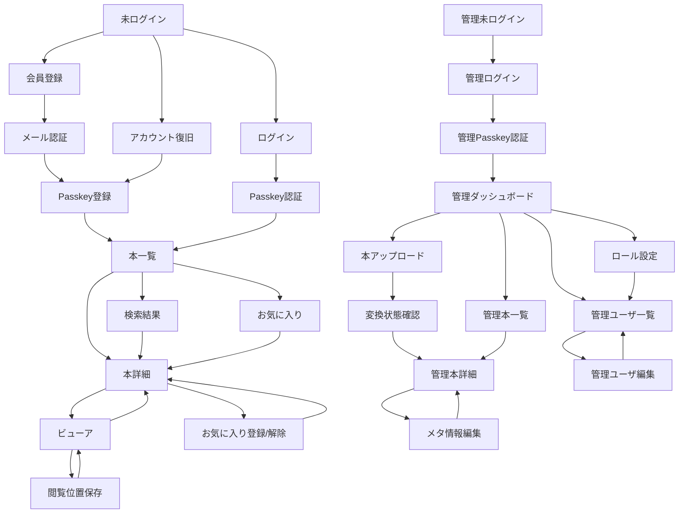

# UIフロー全体図

## 目的

このドキュメントは、自炊本閲覧Webアプリケーションの主要画面遷移と利用者ごとの操作フローを整理する初版である。

詳細なユーザーストーリー、受入条件、画面レイアウト、API仕様は、バックログと各設計ドキュメントで継続的に具体化する。

## 前提

- フロントエンドはNext.jsで実装する。
- 一般ユーザは登録済みの書籍を検索、閲覧、お気に入り管理する。
- 一般ユーザは書籍アップロードを行わず、書籍を保持しない。
- 管理ユーザは書籍アップロード、変換状態確認、メタ情報編集、管理ユーザ管理、ロール管理を行う。
- 書籍アップロードは管理ユーザのみ実行できる。
- 会員登録時にメール認証を行う。
- 一般ユーザログインと管理ユーザログインは画面とセッションを分離する。
- 認証方式はPasskey / WebAuthn方式を採用する。
- 変換処理は非同期ジョブとして実行し、画面は変換完了を待たない。
- PostgreSQLを正本とし、Elasticsearchは検索用の派生データとして扱う。

## 利用者別入口

| 利用者 | 入口 | 主な到達先 |
| --- | --- | --- |
| 未ログインユーザ | ログイン画面、会員登録画面 | 会員登録、メール確認、Passkey登録、Passkeyログイン、アカウント復旧 |
| 一般ユーザ | 本一覧画面 | 本詳細、検索結果、ビューア、お気に入り |
| 管理ユーザ | 管理ログイン画面 | 管理ダッシュボード、本アップロード、メタ情報編集、管理ユーザ管理 |

## 全体フロー

## 一般ユーザ登録フロー

1. 未ログインユーザが会員登録画面を開く。
2. メールアドレス、表示名を入力する。
3. 入力値を検証し、登録要求を送信する。
4. 登録成功後、メール認証待ち画面を表示する。
5. ユーザがメール内リンクまたはトークンで認証を完了する。
6. 認証完了後、Passkey登録へ誘導する。
7. Passkey登録が成功したら、本一覧画面またはログイン画面へ誘導する。

### 主な分岐

| 分岐 | 画面の扱い |
| --- | --- |
| メールアドレス形式不正 | 会員登録画面で入力エラーを表示する。 |
| 登録済みメール | アカウント存在推測を避ける安全なメッセージにする。 |
| メール認証トークン期限切れ | 再送導線を表示する。 |
| Passkey登録失敗 | 再試行または後で登録できる導線を表示する。 |

## ログインフロー

1. ユーザがログイン画面を開く。
2. 初期MVPではメールアドレスを入力する。
3. Passkey認証へ進む。
4. 認証成功後、一般ユーザは本一覧画面へ遷移する。

### 主な分岐

| 分岐 | 画面の扱い |
| --- | --- |
| 認証失敗 | アカウント存在やcredential状態を推測しにくい安全な文言にする。 |
| メール未認証 | メール認証の再送導線を表示する。 |
| Passkeyが使えない | アカウント復旧導線を表示する。 |
| レート制限 | 時間を置いて再試行する案内を表示する。 |

## 本一覧・検索フロー

1. 一般ユーザが本一覧画面を開く。
2. 本一覧はサムネイル、タイトル、著者、タグ、シリーズ、更新日時、読みかけ状態を表示する。
3. ユーザは検索語、タグ、著者、シリーズなどで検索できる。
4. 検索結果画面から本詳細またはビューアへ遷移する。
5. 検索結果がない場合は、条件変更の導線を表示する。

### 主な分岐

| 分岐 | 画面の扱い |
| --- | --- |
| 初回表示 | 更新日時降順などの既定ソートで表示する。 |
| 検索結果なし | 空状態と条件解除導線を表示する。 |
| サムネイル未生成 | 代替表示を使用する。 |
| ページングあり | 次ページ読み込みまたはページ移動を提供する。 |

## 本詳細フロー

1. 一覧または検索結果から本詳細画面へ遷移する。
2. タイトル、著者、タグ、シリーズ、説明、表紙、ページ数、閲覧状態を表示する。
3. ユーザは読み始める、続きから読む、お気に入り登録または解除を実行できる。
4. 読み始める、続きから読む操作でビューア画面へ遷移する。

### 主な分岐

| 分岐 | 画面の扱い |
| --- | --- |
| 閲覧履歴なし | 1ページ目から読む導線を主にする。 |
| 閲覧履歴あり | 続きから読む導線を主にする。 |
| 閲覧不可 | 一般ユーザには存在秘匿または閲覧不可として扱う。 |

## 閲覧フロー

1. ユーザがビューア画面を開く。
2. ページ一覧を取得し、指定ページまたは読みかけページを表示する。
3. 1ページ表示を基本として表示し、画面幅が十分な場合は見開き表示へ切り替えられる候補を持つ。
4. 次ページ、前ページ、最初のページ、最後のページ、ページ番号指定で移動する。
5. 必要に応じて拡大縮小し、表示倍率を変えても現在ページと閲覧位置を維持する。
6. ページ移動時または一定間隔で閲覧位置を保存する。
7. ビューアから本詳細または本一覧へ戻る。

### ビューア操作方針

| 操作 | 初版方針 |
| --- | --- |
| 1ページ表示 | MVPの基本表示とする。 |
| 見開き表示 | Beta / v1.0候補として、デスクトップなど横幅が十分な場合に提供する。奇数ページや最終ページでは空白ページを無理に生成せず、表示できるページだけを表示する。 |
| 次ページ / 前ページ | 画面ボタン、左右キー、タップ領域、スワイプで提供する。先頭、最終ページでは範囲外へ移動しない。 |
| 最初 / 最後へ移動 | ページ数が多い本でも移動できるよう、ビューアの補助操作として提供する。 |
| ページ番号指定 | 入力されたページ番号を1以上総ページ数以下に検証し、範囲外は移動せず入力エラーとして扱う。 |
| 拡大縮小 | Beta / v1.0候補として扱う。倍率変更時もページ番号、表示モード、閲覧位置保存の対象ページを維持する。 |
| キーボード操作 | PC向けに左右キーで前後移動、Home / Endで最初 / 最後へ移動する候補を持つ。入力欄フォーカス中はページ操作を発火しない。 |
| スマートフォン操作 | タップ領域またはスワイプでページ送りできる設計を候補とする。操作ボタンは画像閲覧を妨げない位置に置く。 |
| 閲覧位置保存 | ユーザ単位で最後に表示したページと最終閲覧日時を保存する。端末単位の履歴は初版対象外とする。 |

### 閲覧履歴の扱い

| 項目 | 方針 |
| --- | --- |
| 保存単位 | 一般ユーザと本の組み合わせで一件保存する。 |
| 保存対象 | 最後に表示したページ番号と最終閲覧日時。 |
| 保存タイミング | ページ移動時、ビューア終了時、または一定間隔のいずれかを実装時に選べるようにする。 |
| 再開位置 | 閲覧履歴がある場合は続きから読む導線で保存済みページを開く。履歴がない場合は1ページ目から開く。 |
| 端末単位履歴 | 初版では扱わない。複数端末でもユーザ単位の最後の位置を共有する。 |

## お気に入りフロー

1. ユーザが本詳細画面または本一覧画面でお気に入り登録する。
2. 登録済みの場合は解除操作を表示する。
3. お気に入り画面で登録済みの本を一覧表示する。
4. お気に入り一覧から本詳細またはビューアへ遷移する。

### 主な分岐

| 分岐 | 画面の扱い |
| --- | --- |
| 重複登録 | API側で拒否し、画面は登録済み状態へ整合させる。 |
| お気に入りなし | 空状態と本一覧への導線を表示する。 |
| 対象書籍が閲覧不可 | 一覧から非表示または閲覧不可状態として扱う。 |

## 管理ユーザログインフロー

1. 管理ユーザが管理ログイン画面を開く。
2. 管理ユーザ用のメールアドレスを入力する。
3. Passkey認証へ進む。
4. 認証成功後、管理ダッシュボードへ遷移する。

一般ユーザログイン画面とは入口、セッション、遷移先を分離する。

## 本アップロード・変換確認フロー

1. 管理ユーザが本アップロード画面を開く。
2. zip / rar / 7zip の原本アーカイブとタイトルなどの基本メタ情報を入力する。
3. アップロード要求を送信する。
4. 成功時、変換ジョブ作成結果を表示し、変換状態確認画面へ遷移する。
5. 変換中は状態を更新し、完了後に管理本詳細またはメタ情報編集画面へ遷移できる。
6. 失敗時は失敗理由、再実行導線、メタ情報確認導線を表示する。

### 主な分岐

| 分岐 | 画面の扱い |
| --- | --- |
| 非対応形式 | アップロード画面でエラーを表示する。 |
| 原本保存失敗 | 安全なエラーメッセージを表示する。 |
| 変換ジョブ作成失敗 | 再試行可能な状態として表示する。 |
| 変換失敗 | 変換状態確認画面で失敗状態と再実行導線を表示する。 |

## メタ情報編集フロー

1. 管理ユーザが管理本詳細画面からメタ情報編集画面を開く。
2. タイトル、説明、著者、タグ、シリーズ、シリーズ内順序、種別、公開状態を編集する。
3. 保存時に入力値を検証する。
4. 保存成功後、管理本詳細へ戻る。
5. 検索対象項目が変わる場合は、Elasticsearch更新状態を画面上で確認できる候補を残す。

## 管理ユーザ管理フロー

1. `super_admin`または必要権限を持つ管理ユーザが管理ユーザ一覧を開く。
2. 管理ユーザを検索、絞り込み、一覧表示する。
3. 管理ユーザ登録または編集画面を開く。
4. メールアドレス、表示名、ステータス、ロールを設定する。
5. 保存後、一覧へ戻る。
6. ロール設定画面では固定ロールと権限の対応を確認し、将来的な変更候補を扱う。

### 主な分岐

| 分岐 | 画面の扱い |
| --- | --- |
| 権限不足 | 管理メニューを非表示にし、直接アクセス時は権限不足を表示する。 |
| 最後の`super_admin`停止 | 保存時に拒否し、理由を表示する。 |
| 重複メール | 入力エラーとして表示する。 |

## 画面とAPIの対応

| 画面 | 主なAPI |
| --- | --- |
| 会員登録 | `POST /api/v1/auth/register`, `POST /api/v1/auth/email-verifications/confirm` |
| ログイン | `POST /api/v1/auth/login`, `POST /api/v1/auth/login/confirm`, `POST /api/v1/auth/logout` |
| 本一覧 | `GET /api/v1/books` |
| 本詳細 | `GET /api/v1/books/{bookId}`, `GET /api/v1/books/{bookId}/reading-position` |
| 検索結果 | `GET /api/v1/search/books` |
| ビューア | `GET /api/v1/books/{bookId}/pages`, `GET /api/v1/books/{bookId}/pages/{pageNumber}/image`, `PUT /api/v1/books/{bookId}/reading-position` |
| お気に入り | `GET /api/v1/me/favorites`, `POST /api/v1/books/{bookId}/favorite`, `DELETE /api/v1/books/{bookId}/favorite` |
| 管理ログイン | `POST /api/v1/admin/auth/login`, `POST /api/v1/admin/auth/login/confirm`, `POST /api/v1/admin/auth/logout` |
| 本アップロード | `POST /api/v1/admin/books` |
| 管理本一覧 / 詳細 | `GET /api/v1/admin/books`, `GET /api/v1/admin/books/{bookId}` |
| メタ情報編集 | `PATCH /api/v1/admin/books/{bookId}` |
| 管理ユーザ管理 | `GET /api/v1/admin/admin-users`, `POST /api/v1/admin/admin-users`, `PATCH /api/v1/admin/admin-users/{adminUserId}`, `DELETE /api/v1/admin/admin-users/{adminUserId}` |
| ロール設定 | `GET /api/v1/admin/roles`, `PUT /api/v1/admin/roles/{roleCode}/permissions` |

## 後続で詳細化する事項

- 画面ごとのワイヤーフレーム。
- ビューアの見開き、拡大縮小、キーボード操作、スマートフォン操作の詳細仕様。
- 管理ダッシュボードに表示するジョブ状態、検索インデックス状態、運用状態。
- 権限マトリクス変更時の管理メニュー表示制御。
- エラー表示文言とフォームバリデーション詳細。
