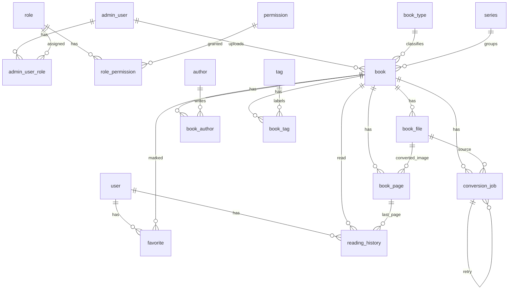

# データモデル初版

## 目的

このドキュメントは、自炊本閲覧Webアプリケーションの主要エンティティと関連を整理し、PostgreSQLを正本とするデータモデル初版を定義する。

実装時の物理DDL、インデックス名、制約名、カラム型の細部は、Spring Boot実装とマイグレーション作成時に具体化する。この初版では、業務上の正本、関連、状態、論理削除、権限境界を明確にする。

## 前提

- PostgreSQLを正本データストアとする。
- Elasticsearchは検索用の派生インデックスであり、PostgreSQLから再構築可能とする。
- 原本ファイル、変換済みWebP、サムネイルの実体はファイル保存領域に保存し、PostgreSQLには管理情報を保存する。
- 一般ユーザは書籍を保持せず、書籍アップロードも行わない。
- 書籍アップロードは管理ユーザのみが実行できる。
- 変換ジョブの配送は専用キューで行い、業務上のジョブ状態はPostgreSQLで管理する。
- APIモデル、永続化エンティティ、ドメインモデルは概念的に分離する。

## ドメイン境界

初期のSpring Bootアプリケーションでは、次の境界を意識してモデルを分ける。

| 境界 | 主なエンティティ | 責務 |
| --- | --- | --- |
| ユーザ / 認証 / 権限 | `user`, `admin_user`, `role`, `permission`, `admin_user_role`, `role_permission` | 一般ユーザ、管理ユーザ、ロール、操作権限を管理する。 |
| 書籍カタログ | `book`, `author`, `series`, `book_type`, `tag`, `book_author`, `book_tag` | 書籍メタ情報、著者、タグ、シリーズ、種別を管理する。 |
| ファイル取込 / 保存管理 | `book_file` | 原本ファイル、変換済み生成物、サムネイルの管理情報を保持する。 |
| 変換ジョブ管理 | `conversion_job` | 変換ジョブの業務状態、失敗理由、再実行に必要な情報を保持する。 |
| 閲覧 | `book_page`, `reading_history` | ページ順、閲覧画像、読みかけ位置を管理する。 |
| お気に入り | `favorite` | 一般ユーザと書籍のお気に入り関連を管理する。 |

## 主要な設計判断

### 一般ユーザと管理ユーザ

一般ユーザと管理ユーザは、初版では別テーブルとして扱う。

理由は次のとおり。

- 一般ユーザは閲覧、お気に入り、閲覧履歴が主な関心であり、管理ユーザは書籍アップロード、メタ情報管理、ユーザ管理、ロール管理が主な関心である。
- 管理ユーザにはロール、権限、管理操作の監査対象という別の属性が必要になりやすい。
- 一般ユーザは書籍を保持しないため、書籍との所有関係を持たせない。

共通のログイン、メール認証、パスワードリセットの詳細は、後続の権限設計とAPI契約で定義する。実装時に認証基盤の都合で共通の認証主体テーブルを追加する場合でも、このドキュメント上の業務概念としては一般ユーザと管理ユーザを分けて扱う。

### 書籍アップロード権限

`book` と `book_file` の作成主体は管理ユーザとする。`book.uploaded_by_admin_user_id` にアップロードした管理ユーザを記録する。

一般ユーザには書籍所有権を持たせないため、`book` から `user` への所有者外部キーは作成しない。

### 論理削除

利用者、書籍、メタ情報は初版では論理削除を基本とする。

| 対象 | 方針 |
| --- | --- |
| `user` | 退会、停止、復元余地、閲覧履歴との整合性のため論理削除する。 |
| `admin_user` | 監査と過去の操作主体参照のため論理削除する。 |
| `book` | 原本ファイル、生成物、検索インデックス削除との整合性を保つため論理削除する。 |
| `author`, `series`, `book_type`, `tag` | 過去の関連や表記整理に備えて論理削除する。 |
| `favorite` | ユーザ操作としては物理削除相当でよいが、初版では`deleted_at`を持たせ、重複制約と整合する形を実装時に決める。 |
| `reading_history` | ユーザ退会時の扱いと合わせて後続の認証、権限設計で保持期間を決める。初版では論理削除対象に含める。 |

論理削除済みの書籍は通常の一覧、検索、閲覧対象から除外する。Elasticsearch上の検索ドキュメントは、PostgreSQLを正として削除または再インデックスで回復できるようにする。

### 変換ジョブ状態管理

変換ジョブの配送は専用キューで行うが、ジョブの業務状態は`conversion_job`に保存する。

初期状態は次の値を使用する。

| 状態 | 意味 |
| --- | --- |
| `queued` | 変換待ち。キュー投入済み、または再投入待ち。 |
| `extracting` | 原本アーカイブを展開中。 |
| `converting` | ページ画像のWebP変換、またはサムネイル生成中。 |
| `completed` | 変換が完了し、閲覧に必要なページ情報と生成物が揃っている。 |
| `failed` | 変換に失敗し、失敗理由を確認できる。 |
| `canceled` | 管理操作またはシステム判断で取り消された。 |

再実行は、既存ジョブを`queued`へ戻す方式または新しいジョブ行を作成する方式がある。初版では履歴性を優先し、再実行時は新しい`conversion_job`を作成し、`retry_of_conversion_job_id`で元ジョブを参照する方針とする。

## エンティティ一覧

### user

一般ユーザを表す。

| 項目 | 内容 |
| --- | --- |
| 主キー | `id` |
| 主な属性 | `email`, `password_hash`, `display_name`, `email_verified_at`, `status`, `last_login_at`, `created_at`, `updated_at`, `deleted_at` |
| 主な関連 | `favorite`, `reading_history` |
| 制約 | `email`は有効な一般ユーザ内で一意にする。 |

`status`は`registered`, `active`, `suspended`, `withdrawn`を初期候補とする。

### admin_user

管理操作を行う利用者を表す。

| 項目 | 内容 |
| --- | --- |
| 主キー | `id` |
| 主な属性 | `email`, `password_hash`, `display_name`, `status`, `last_login_at`, `created_at`, `updated_at`, `deleted_at` |
| 主な関連 | `admin_user_role`, `book.uploaded_by_admin_user_id` |
| 制約 | `email`は有効な管理ユーザ内で一意にする。 |

`status`は`active`, `suspended`, `deleted`を初期候補とする。

### role

管理ユーザに割り当てる権限のまとまりを表す。

| 項目 | 内容 |
| --- | --- |
| 主キー | `id` |
| 主な属性 | `code`, `name`, `description`, `created_at`, `updated_at`, `deleted_at` |
| 主な関連 | `admin_user_role`, `role_permission` |
| 制約 | `code`は有効なロール内で一意にする。 |

初期候補は`super_admin`, `admin`, `operator`, `viewer`とする。詳細は権限設計で定義する。

### permission

操作単位の権限を表す。

| 項目 | 内容 |
| --- | --- |
| 主キー | `id` |
| 主な属性 | `code`, `name`, `description`, `created_at`, `updated_at` |
| 主な関連 | `role_permission` |
| 制約 | `code`を一意にする。 |

書籍アップロード、書籍削除、変換ジョブ再実行、ユーザ停止、ロール設定などを権限候補とする。

### book

アプリケーション上で管理する書籍を表す。

| 項目 | 内容 |
| --- | --- |
| 主キー | `id` |
| 主な属性 | `title`, `description`, `book_type_id`, `series_id`, `series_order`, `uploaded_by_admin_user_id`, `publication_date`, `visibility_status`, `created_at`, `updated_at`, `deleted_at` |
| 主な関連 | `book_file`, `book_page`, `book_author`, `book_tag`, `favorite`, `reading_history`, `conversion_job` |
| 制約 | 論理削除されていない書籍を一覧、検索、閲覧対象にする。 |

`visibility_status`は`draft`, `converting`, `available`, `failed`, `hidden`, `deleted`を初期候補とする。シリーズ内の順序は`series_order`で保持する。

### book_file

書籍に関連するファイル管理情報を表す。

| 項目 | 内容 |
| --- | --- |
| 主キー | `id` |
| 主な属性 | `book_id`, `file_role`, `storage_key`, `original_file_name`, `content_type`, `file_size_bytes`, `checksum`, `created_at`, `deleted_at` |
| 主な関連 | `book`, `book_page` |
| 制約 | 内部物理パスをAPIレスポンスへ直接露出しない。 |

`file_role`は`original_archive`, `converted_page`, `thumbnail`を初期候補とする。ファイル実体はファイル保存領域に置き、`storage_key`で参照する。

### book_page

書籍のページ情報を表す。

| 項目 | 内容 |
| --- | --- |
| 主キー | `id` |
| 主な属性 | `book_id`, `page_number`, `source_entry_name`, `converted_file_id`, `width`, `height`, `created_at`, `updated_at`, `deleted_at` |
| 主な関連 | `book`, `book_file`, `reading_history` |
| 制約 | 同一書籍内の`page_number`は一意にする。 |

`page_number`は1始まりの表示順とする。自然順ソートやサブディレクトリを含む順序決定は画像変換設計で詳細化する。

### author

書籍の著者、作画者、編集者などを表す。

| 項目 | 内容 |
| --- | --- |
| 主キー | `id` |
| 主な属性 | `name`, `name_kana`, `description`, `created_at`, `updated_at`, `deleted_at` |
| 主な関連 | `book_author` |
| 制約 | 表記揺れ整理のため、同名の扱いは後続の検索設計、管理画面設計で詳細化する。 |

書籍と著者は多対多とする。

### series

複数の書籍をまとめる単位を表す。

| 項目 | 内容 |
| --- | --- |
| 主キー | `id` |
| 主な属性 | `name`, `name_kana`, `description`, `created_at`, `updated_at`, `deleted_at` |
| 主な関連 | `book` |
| 制約 | シリーズ内の並び順は`book.series_order`で管理する。 |

### book_type

書籍の種別を表す。

| 項目 | 内容 |
| --- | --- |
| 主キー | `id` |
| 主な属性 | `code`, `name`, `description`, `display_order`, `created_at`, `updated_at`, `deleted_at` |
| 主な関連 | `book` |
| 制約 | `code`は有効な種別内で一意にする。 |

単行本、雑誌、アンソロジーなどを初期候補とする。

### tag

書籍を分類、検索するためのラベルを表す。

| 項目 | 内容 |
| --- | --- |
| 主キー | `id` |
| 主な属性 | `name`, `description`, `created_at`, `updated_at`, `deleted_at` |
| 主な関連 | `book_tag` |
| 制約 | 有効なタグ名は一意にする。 |

書籍とタグは多対多とする。

### favorite

一般ユーザのお気に入り登録を表す。

| 項目 | 内容 |
| --- | --- |
| 主キー | `id` |
| 主な属性 | `user_id`, `book_id`, `created_at`, `deleted_at` |
| 主な関連 | `user`, `book` |
| 制約 | 同一ユーザ、同一書籍の有効なお気に入りは一件までとする。 |

一般ユーザのみを対象とし、管理ユーザのお気に入りは初版の対象外とする。

### conversion_job

書籍の変換ジョブを表す。

| 項目 | 内容 |
| --- | --- |
| 主キー | `id` |
| 主な属性 | `book_id`, `source_file_id`, `status`, `queued_at`, `started_at`, `finished_at`, `attempt_number`, `retry_of_conversion_job_id`, `worker_id`, `failure_phase`, `failure_code`, `failure_message`, `external_exit_code`, `timed_out`, `created_at`, `updated_at` |
| 主な関連 | `book`, `book_file`, `conversion_job.retry_of_conversion_job_id` |
| 制約 | 状態遷移はアプリケーションサービスで検証する。 |

失敗理由は運用診断に必要な範囲に限定し、パスワード、トークン、内部パス、過度な個人情報を記録しない。

### reading_history

一般ユーザの読みかけ位置を表す。

| 項目 | 内容 |
| --- | --- |
| 主キー | `id` |
| 主な属性 | `user_id`, `book_id`, `last_page_id`, `last_read_at`, `created_at`, `updated_at`, `deleted_at` |
| 主な関連 | `user`, `book`, `book_page` |
| 制約 | 同一ユーザ、同一書籍の有効な閲覧履歴は一件までとする。 |

端末単位ではなく、初版ではユーザ単位で読みかけ位置を保存する。

## 関連テーブル

### admin_user_role

管理ユーザとロールの多対多関連を表す。

| 項目 | 内容 |
| --- | --- |
| 主な属性 | `admin_user_id`, `role_id`, `created_at` |
| 制約 | 同一管理ユーザ、同一ロールの関連は一件までとする。 |

### role_permission

ロールと権限の多対多関連を表す。

| 項目 | 内容 |
| --- | --- |
| 主な属性 | `role_id`, `permission_id`, `created_at` |
| 制約 | 同一ロール、同一権限の関連は一件までとする。 |

### book_author

書籍と著者の多対多関連を表す。

| 項目 | 内容 |
| --- | --- |
| 主な属性 | `book_id`, `author_id`, `author_role`, `display_order`, `created_at` |
| 制約 | 同一書籍、同一著者、同一役割の関連は一件までとする。 |

`author_role`は`author`, `artist`, `editor`, `other`を初期候補とする。

### book_tag

書籍とタグの多対多関連を表す。

| 項目 | 内容 |
| --- | --- |
| 主な属性 | `book_id`, `tag_id`, `created_at` |
| 制約 | 同一書籍、同一タグの関連は一件までとする。 |

## ER図

## 状態と制約の初期方針

| 項目 | 方針 |
| --- | --- |
| ID | 実装時は推測困難性とURL露出方針を踏まえ、UUIDまたは代替公開IDを検討する。 |
| 日時 | `created_at`, `updated_at`, `deleted_at`を基本とし、タイムゾーンを一貫して扱う。 |
| 楽観ロック | 書籍メタ情報、変換ジョブ、ユーザ、管理ユーザは同時更新に備えて実装時に`version`列を検討する。 |
| 検索対象 | `book`, `author`, `series`, `tag`, `book_type`の正本からElasticsearchへ派生インデックスを作る。 |
| ページング | 一覧、検索、ジョブ一覧、ユーザ一覧は大量データを想定し、APIでページングする。 |
| 内部パス | `storage_key`は内部参照用とし、物理パスやコンテナパスをAPIレスポンスへ直接出さない。 |

## 後続設計で詳細化する事項

- 認証方式、メール認証、2段階認証、パスワードリセット用トークンのデータモデル。
- 管理ロール一覧、権限マトリクス、一般ユーザ停止の詳細。
- ファイル保存先、命名規則、原本、WebP、サムネイルの削除タイミング。
- 画像判定、ページ順序、再変換時の既存生成物の扱い。
- Elasticsearchのインデックス名、mapping、analyzer、再インデックス状態管理。
- 監査ログ、操作履歴、障害ログの保持範囲。

## 更新方針

エンティティ、関連、状態、論理削除、権限境界が変わった場合は、このドキュメントを更新する。

実装で物理DDLや永続化エンティティを作成した場合は、設計との差分を確認し、必要に応じてこの初版を改訂する。
