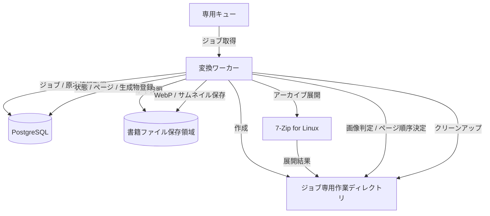

# 画像変換設計初版

## 目的

このドキュメントは、自炊本閲覧Webアプリケーションにおける画像変換処理の初期仕様を定義する。

対象は、変換ワーカー、アーカイブ展開、画像ファイル判定、ページ順序、WebP変換、サムネイル生成、変換ジョブ状態、再変換、リソース制限、失敗時の扱いである。

## 前提

- 画像変換はSpring Boot 4.0.6変換ワーカーで非同期に実行する。
- バックエンドAPIはアップロード受付、原本保存、PostgreSQL登録、専用キュー投入までを行い、変換完了を待たない。
- PostgreSQLを変換ジョブ状態、書籍、ページ、ファイル管理情報の正本とする。
- 変換済みWebPとサムネイルは原本ファイルから再生成可能な派生ファイルとして扱う。
- zip / rar / 7zipの展開には、変換ワーカーコンテナ内の7-Zip for Linuxコンソール版を使用する。
- WebP品質値の既定値は80とし、application.propertiesで変更可能にする。
- 変換ワーカーの同時実行数の既定値は10、1ジョブのタイムアウトは30分とする。

## 処理概要



処理の基本順序は次のとおり。

1. 専用キューから変換ジョブを取得する。
2. PostgreSQLでジョブ、書籍、原本ファイル管理情報を確認する。
3. ジョブごとの専用作業ディレクトリを作成する。
4. 7-Zip for Linuxコンソール版で原本アーカイブを展開する。
5. 展開結果のパスとファイル種別を検証する。
6. 画像ファイルを抽出し、ページ順序を決定する。
7. ページ画像をWebPへ変換する。
8. 表紙または先頭ページからサムネイルを生成する。
9. 変換済みWebP、サムネイル、ページ情報、生成物管理情報を保存する。
10. 変換ジョブ状態を完了または失敗へ更新し、作業ディレクトリをクリーンアップする。

## アーカイブ展開

対応する原本アーカイブ形式は、zip / rar / 7zipとする。

アーカイブ展開には、変換ワーカーコンテナ内に配置した7-Zip for Linuxコンソール版を使用する。zipも含めて同じ外部プロセスで扱い、形式ごとの差を変換ワーカーの外部プロセス制御に閉じ込める。

| 項目 | 方針 |
| --- | --- |
| 実行主体 | Spring Boot変換ワーカー |
| 実行方式 | 7-Zip for Linuxコンソール版を外部プロセスとして呼び出す |
| 対応形式 | zip / rar / 7zip |
| 作業場所 | ジョブごとの専用作業ディレクトリ |
| タイムアウト | 1ジョブ30分の範囲で制御する |
| 結果記録 | 終了コード、タイムアウト有無、失敗工程、失敗理由を`conversion_job`へ記録する |

アーカイブ内パスは信頼しない。絶対パス、`..`を含む相対パス、ドライブレター、シンボリックリンク、展開先ルート外へ解決されるパスは拒否する。

暗号化アーカイブは初版では非対応とし、検出した場合は`failed`へ遷移させる。破損アーカイブ、空アーカイブ、対応画像が含まれないアーカイブも`failed`とし、運用者が原因を区別できる失敗コードを記録する。

## 作業ディレクトリ

変換ワーカーは、ジョブごとに専用作業ディレクトリを作成する。

```text
{worker_work_root}/
  jobs/
    {conversion_job_id}/
      extract/
      output/
      thumbnails/
```

| ディレクトリ | 用途 |
| --- | --- |
| `extract/` | 7-Zipによる展開先 |
| `output/` | WebP変換の一時出力先 |
| `thumbnails/` | サムネイル生成の一時出力先 |

作業ディレクトリのルートはapplication.propertiesで設定可能にする。ジョブ完了、失敗、キャンセル、タイムアウトのいずれの場合もクリーンアップを試行する。

クリーンアップ失敗は、変換結果そのものとは別の運用確認事項としてログまたはジョブ診断情報へ記録する。一時ファイル残存はRunbookで確認、削除できるようにする。

## 画像ファイル判定

画像ファイル判定は、拡張子だけに依存しない。

初版では次の順で検証する。

1. アーカイブ内エントリが通常ファイルであることを確認する。
2. 拡張子が対応候補であることを確認する。
3. 画像デコーダで実体を読み取り、画像として扱えることを確認する。
4. 読み取った画像の幅、高さ、ピクセル形式を検証する。

対応画像形式の初期候補は、JPEG、PNG、WebP、GIFの静止画、BMPとする。アニメーションGIFなど複数フレームを持つ画像は初版では先頭フレームのみを対象候補とし、実装時に安全に扱えない場合は非対応として失敗させる。

隠しファイル、OSメタデータファイル、ディレクトリ、サイズ0のファイル、画像として読み取れないファイルはページ候補から除外する。ただし、除外後にページ候補が0件になる場合はジョブを`failed`にする。

## ページ順序

ページ順序は、展開後の画像ファイルの相対パスを基準に決定する。

初版では次の方針とする。

| 項目 | 方針 |
| --- | --- |
| 基本順序 | 相対パスの自然順ソート |
| 大文字小文字 | 大文字小文字を区別しない |
| 数値 | `1`, `2`, `10`が人間の期待どおりに並ぶ自然順とする |
| サブディレクトリ | ディレクトリ階層を含めた相対パスで並べる |
| 同一名衝突 | 正規化後に衝突する場合は元の相対パスを第2キーにする |
| 表紙 | 1ページ目を表紙とする |

`book_page.page_number`は1始まりの連番とする。元のアーカイブ内エントリ名は、診断と並び順確認のため`book_page.source_entry_name`に保存する。ただし、APIレスポンスやログへ出す場合は、内部パスや不要な個人情報を含めないように扱う。

## WebP変換

閲覧用ページ画像はWebPへ変換する。

| 項目 | 初期方針 |
| --- | --- |
| 出力形式 | WebP |
| 品質値 | 80 |
| 設定方法 | application.propertiesで変更可能にする |
| 最大幅 / 最大高さ | 初版では固定上限を設けない |
| 拡大表示 | 初期想定では対象外 |
| 透過画像 | 背景を白として閲覧向けWebPへ変換する方針を初期候補とする |
| 縦長画像 | 分割せず1ページとして扱う |

品質値80は、スマートフォン閲覧で本文やセリフの可読性を保ちつつ、過度な高品質設定を避けるための既定値である。実装後の実測やサンプル確認で可読性、ファイルサイズ、変換時間に問題が出る場合は見直す。

WebP変換に失敗したページがある場合、初版ではジョブ全体を`failed`にする。部分的に閲覧可能な状態は提供せず、ページ情報と生成物の整合性を優先する。

## サムネイル生成

サムネイルは生成する。

初版では1ページ目を表紙として、表紙サムネイルを生成する。一覧、検索結果、詳細画面で同じサムネイルを共有してよい。画面ごとのサイズ最適化が必要になった段階で用途別サムネイルを追加する。

| 項目 | 初期方針 |
| --- | --- |
| 生成元 | 1ページ目の変換済みWebP、または同じ元画像 |
| 出力形式 | WebP |
| ファイル名 | `cover.webp` |
| 保存先 | 書籍ファイル保存領域の`thumbnails/` |
| 管理情報 | `book_file.file_role = thumbnail`としてPostgreSQLへ記録する |

サムネイル生成に失敗した場合、初版ではジョブ全体を`failed`にする。一覧や検索結果の表示性能と見た目に影響するため、変換完了条件に含める。

## 変換ジョブ状態

変換ジョブ状態はPostgreSQLの`conversion_job.status`で管理する。

| 状態 | 意味 | 主な遷移元 | 主な遷移先 |
| --- | --- | --- | --- |
| `queued` | 変換待ち。キュー投入済み、または再投入待ち。 | 新規作成、再実行 | `extracting`, `failed`, `canceled` |
| `extracting` | 原本アーカイブを展開中。 | `queued` | `converting`, `failed`, `canceled` |
| `converting` | ページ画像のWebP変換、またはサムネイル生成中。 | `extracting` | `completed`, `failed`, `canceled` |
| `completed` | 閲覧に必要なページ情報と生成物が揃っている。 | `converting` | 再変換時に新規ジョブ作成 |
| `failed` | 変換に失敗し、失敗理由を確認できる。 | `queued`, `extracting`, `converting` | 再実行時に新規ジョブ作成 |
| `canceled` | 管理操作またはシステム判断で取り消された。 | `queued`, `extracting`, `converting` | 再実行時に新規ジョブ作成 |

失敗時は、`failure_phase`、`failure_code`、`failure_message`、`external_exit_code`、`timed_out`を記録する。`failure_message`には秘密情報、トークン、内部物理パス、過度な個人情報を含めない。

## 再変換

再変換は、原本ファイルを利用して新しい変換ジョブを作成する方式とする。

既存ジョブを直接`queued`へ戻さず、新しい`conversion_job`を作成し、`retry_of_conversion_job_id`で元ジョブを参照する。これにより、失敗履歴、再実行履歴、変換条件の差分を追跡しやすくする。

再変換時は、既存の`pages/`と`thumbnails/`を直接上書きしない。ジョブ専用作業ディレクトリと一時出力先に新しい生成物を作成し、PostgreSQL更新が成功してから保存領域の生成物を差し替える。

途中で失敗した場合は、既存の閲覧可能なWebPとサムネイルを壊さないことを優先する。

## リソース制限と設定

初期設定項目候補は次のとおり。

| 設定項目 | 既定値 | 用途 |
| --- | --- | --- |
| `conversion.worker.concurrency` | `10` | 変換ワーカーの同時実行数 |
| `conversion.job.timeout` | `30m` | 1ジョブのタイムアウト |
| `conversion.webp.quality` | `80` | WebP品質値 |
| `conversion.worker.work-root` | 環境ごとに設定 | ジョブ専用作業ディレクトリのルート |
| `conversion.sevenzip.executable-path` | 環境ごとに設定 | 7-Zip for Linuxコンソール版の実行ファイルパス |

1ジョブの一時ディスク使用量には、初版ではアプリケーション上限を設けない。CPU、メモリ、ディスクI/O、一時ディスク容量はOSまたはコンテナ側の制限と監視で扱う。

同時実行数10や30分タイムアウトで問題が出る場合は、ホストリソース、キュー滞留、変換時間、ページ数、画像解像度を確認して設定を見直す。

## 失敗時の扱い

| 失敗箇所 | 状態 | 記録する主な情報 |
| --- | --- | --- |
| ジョブ整合性確認 | `failed` | 書籍なし、原本ファイル管理情報なし、状態不整合 |
| 原本ファイル参照 | `failed` | 原本ファイル欠落、読み取り不可 |
| アーカイブ展開 | `failed` | 7-Zip終了コード、標準エラー要約、暗号化、破損、タイムアウト |
| パス検証 | `failed` | パストラバーサル、絶対パス、シンボリックリンク |
| 画像判定 | `failed` | 対応画像なし、破損画像、非対応形式 |
| WebP変換 | `failed` | 対象ページ、変換条件、失敗コード |
| サムネイル生成 | `failed` | 生成元、失敗コード |
| 生成物保存 | `failed` | 保存先種別、保存失敗理由 |
| PostgreSQL更新 | `failed`または要整合性確認 | 更新失敗、生成物残存の有無 |
| クリーンアップ | 変換結果とは別に記録 | 残存作業ディレクトリ、削除失敗理由 |

失敗時に途中生成物が残った場合は、PostgreSQLを正として再変換または生成物クリーンアップを行う。生成物がPostgreSQLへ登録されていない場合、通常の閲覧対象にはしない。

## セキュリティ

- アップロードファイル名、アーカイブ内パス、展開先パス、生成ファイル名を信頼しない。
- 展開先はジョブ専用作業ディレクトリに限定し、保存領域外への脱出を拒否する。
- 7-Zipの引数は固定のテンプレートから組み立て、ユーザ入力をコマンド文字列として解釈させない。
- 物理パス、コンテナパス、`storage_key`をAPIレスポンスへ直接露出しない。
- 失敗理由やログには、秘密情報、トークン、パスワード、不要な個人情報を含めない。
- 変換ワーカーはAPIから分離し、重い処理や外部プロセス失敗がHTTP処理へ直接波及しないようにする。

## 後続設計で詳細化する事項

- サムネイルの具体サイズと用途別生成数。
- WebP変換時の最大幅、最大高さ、色空間、透過画像の最終仕様。
- キュー製品、ack、retry、dead letter、重複配送時の冪等性。
- 管理画面またはAPIからの再実行、キャンセル、ジョブ詳細確認の契約。
- Runbookにおける失敗ジョブ確認、残存作業ディレクトリ削除、再変換手順。
- 実装で採用する画像処理ライブラリと、各画像形式の正確な対応範囲。

## 更新方針

対応アーカイブ形式、画像判定、ページ順序、変換条件、サムネイル仕様、ジョブ状態、再変換方式、リソース制限が変わった場合は、このドキュメントを更新する。

実装や運用で得た変換時間、失敗理由、画質確認結果により初期値が不適切と分かった場合は、ADRまたは設計ドキュメントへ理由を残したうえで見直す。
